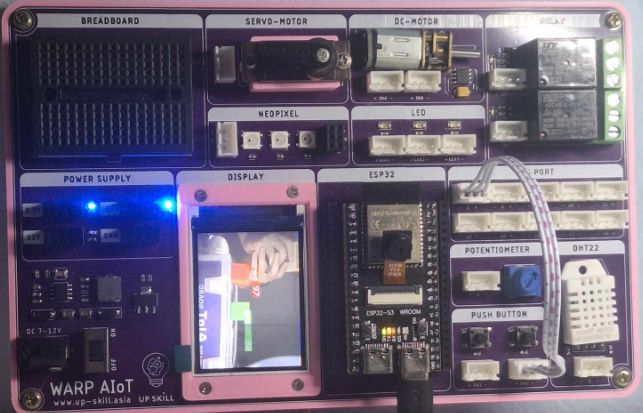
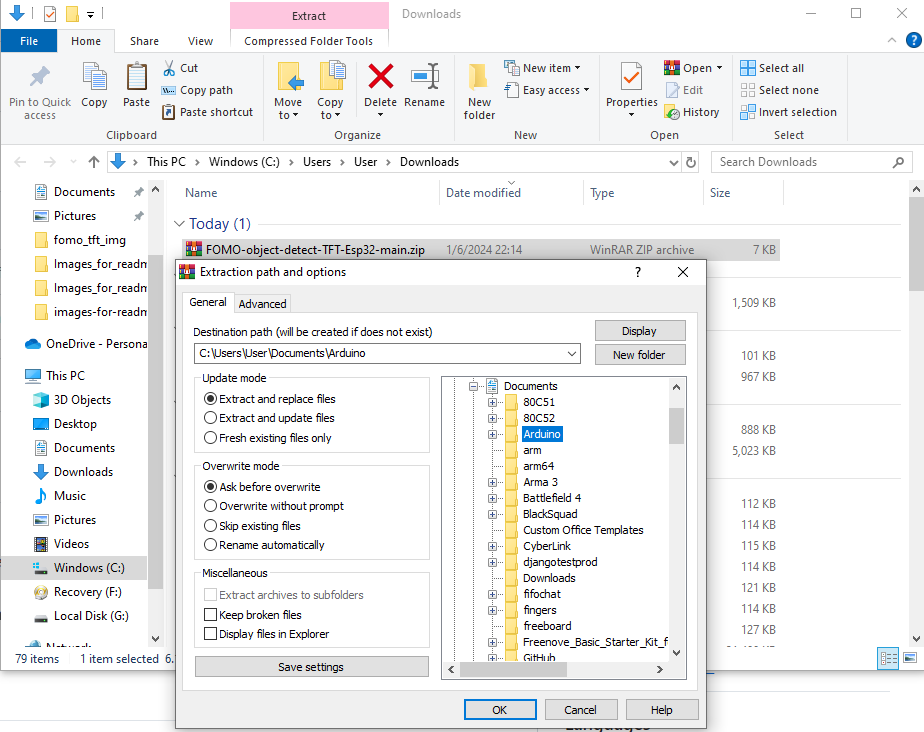
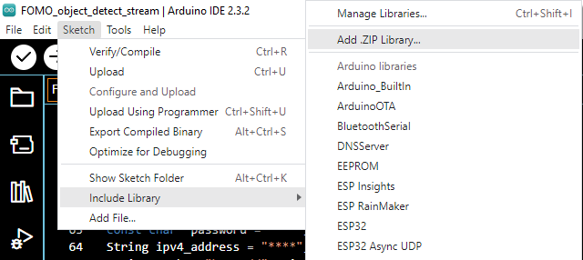
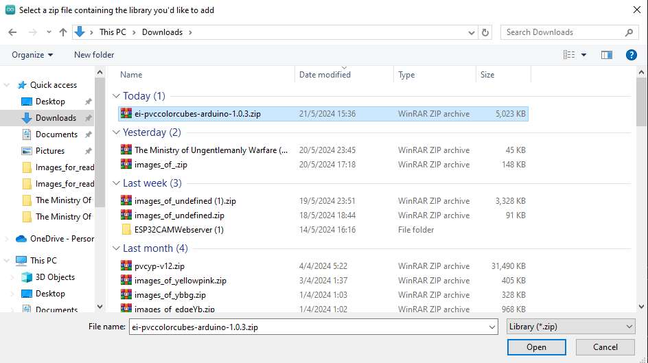

# FOMO-object-detect-TFT-Esp32
[ฉบับไทย](https://github.com/San279/object-detect-FOMO-TFT-Esp32/blob/main/README-th.md)
   
This project was intended for displaying camera feed and inference results of [FOMO object detection model](https://edge-impulse.gitbook.io/docs/edge-impulse-studio/learning-blocks/object-detection/fomo-object-detection-for-constrained-devices) by [Edge Impulse](https://edgeimpulse.com/) to TFT screen. The Hardware were provided by [Wireless Solution Asia](https://wirelesssolution.asia/). To run this project users must obtain a model from Edge Impulse. 
   
<strong> - Before using this repository please obtain a model from [FOMO](https://github.com/San279/train-FOMO-object-detect-esp32) and set up [TFT and camera](https://github.com/San279/camera-tft-esp32) properly before running this project</strong> 
   

    
## What you'll need
- [Arduino IDE](https://www.arduino.cc/en/software), preferably the latest ones, but older versions will still do the job.
- ESP32-S3 is preferable but older version will do just fine.
- ST7789 or any TFT screens.
- OV2640 camera or any OV series.
## Project files descriptions
- FOMO_object_detect_TFT.ino - Containes Arduino codes displaying camera feed and FOMO results to TFT screens.
## How to install and run the project
<strong> 1. Download the zip file and extract it to Arduino directory. </strong>
  

   <b />
<strong> 2. Open Fomo_object_detect_TFT.ino, under tools change your Board to "ESP32S3 Dev Module" and PSRAM to "OPI PSRAM". </strong> 
  

    
<strong> 3. Add the zip folder of the trained model obtained from Edge Impulse to Arduino IDE. </strong> 
  

  

    
 4. Connect pin no.1 of the Esp32 to a push button.
- if you're using [AIOT board](https://wirelesssolution.asia/), simply connect I/O port 1 to any push button.   

  
- if you do not have AIoT board, connect I/O pin 1 of Esp32 to one leg of a push button and other leg to 3v.

        
<strong> 5. Open FOMO_object_detect_TFT.ino and match the name of project in Edge Impulse with header file in line 24. </strong>
    

    
<strong> 6. Upload the code, this process might take up to 30 minutes, and you're Done!! </strong>
  

    

## Project features
- User can change resolution of the camera when the push button is pressed. The avaiable resolution is as follow.   
- 96 X 96   

   
- QQVGA 160 X 120    

   
- 176 X 144    

   
- 240 X 176    

   
- 240 X 240    

   
- 320 X 240    

   

## Credit
Thanks to [WIRELESS SOLUTION ASIA CO.,LTD](https://wirelesssolution.asia/) for providing AIOT board to support this project. Also thanks to [Bodmer / TFT_eSPI](https://github.com/Bodmer/TFT_eSPI/blob/master/README.md) for the TFT libraries. Scripted used for Esp32 FOMO object detection inferencing were provided by [Edge Impulse](https://edge-impulse.gitbook.io/docs/edge-impulse-studio/learning-blocks/object-detection/fomo-object-detection-for-constrained-devices). 
